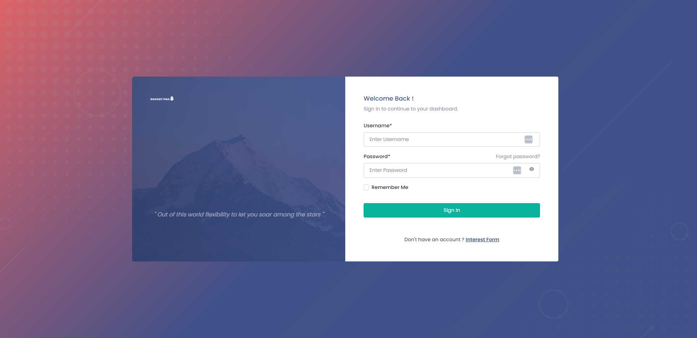
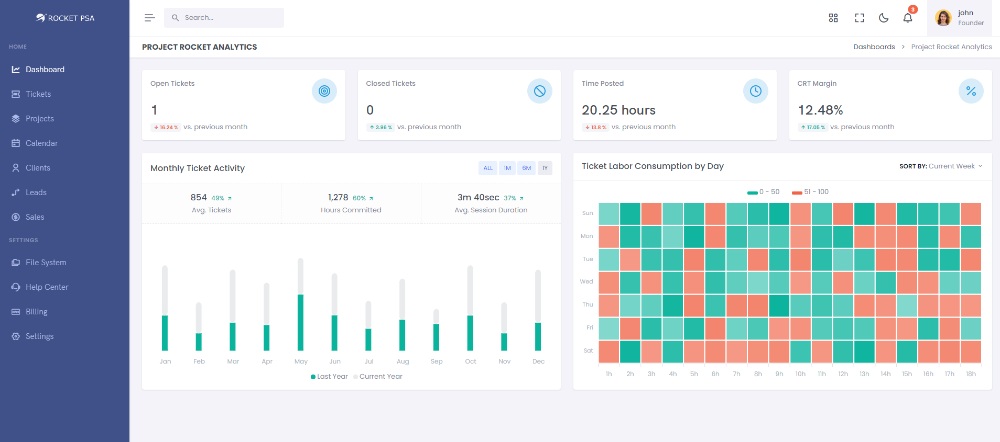
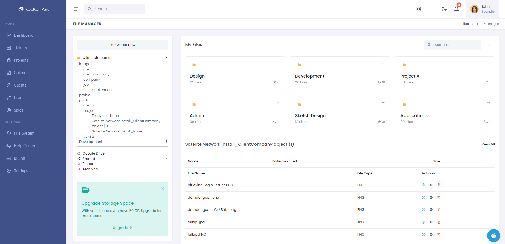
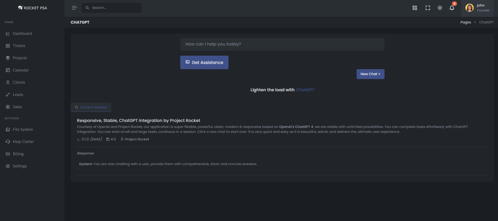

# ProjectRocket's MSP Dashboard

## Overview
ProjectRocket is an advanced solution designed to empower Managed Service Providers (MSP) with cutting-edge ticket and project management capabilities. Our platform integrates a clean-cut Customer Relationship Management (CRM) system, a comprehensive filesystem, and advanced AI tools to streamline and optimize MSP operations. Built using Python's Django framework, Vue.js, and PostgreSQL, ProjectRocket runs on a robust cloud infrastructure, offering reliability, scalability, and performance.

## Features
### Ticket Management

- Efficiently handle and track support tickets.
- Detailed analytics on ticket activities and labor consumption.

## Project Management

- Organize, monitor, and manage multiple projects seamlessly.
- Track project progress and deadlines effectively.

## Customer Relationship Management (CRM)
- Maintain detailed records of clients and leads.
- Improve customer interactions and satisfaction.

## Filesystem
- Manage and organize files with a structured directory.
- Integrate with Google Drive for extended storage capabilities.

## AI Tools
- Leverage AI for predictive analytics and automation.
- Enhance decision-making and operational efficiency.

## Technology Stack
- Frontend: Vue.js for dynamic and responsive user interfaces.
- Backend: Django framework to ensure robust and secure backend operations.
- Database: PostgreSQL for reliable and scalable data management.
- Design: Bootstrap 5 for a sleek, professional, and user-friendly design.
- Infrastructure: Hosted on a scalable cloud environment ensuring high availability and performance.

## Screenshots
### Log In
Simple, clean, intelligent login


### Dashboard
The dashboard provides an overview of open tickets, closed tickets, monthly ticket activity, and other key metrics, giving users a comprehensive insight into their operations.


### File Manager
The file manager allows users to organize files efficiently, with options for Google Drive integration, and structured directories for different client and project files.


### AI Tools
From that latest and greatest LLMs to future development in RAGs, with Project Rocket's scientist team you have access to the industry's most cutting-edge tools.


# Getting Started
## Prerequisites
- Python 3.8+
- Node.js 12+
- PostgreSQL 12+
- Django 3.2+
- Vue.js 2.6+
- Bootstrap 5

## Installation
Clone the repository:

```
git clone https://github.com/yourusername/ProjectRocket.git
cd ProjectRocket
```

## Backend Setup:

Create a virtual environment and activate it:
```
python -m venv venv
source venv/bin/activate  # On Windows use `venv\Scripts\activate`
```

Install the required Python packages:
```
pip install -r requirements.txt
```

Start a PostgreSQL Server on Docker:
```
docker run -d -e POSTGRES_PASSWORD=1234 -e POSTGRES_USER=postgres -e POSTGRES_DB=postgres -p 5432:5432 postgres
```

Start a valkey docker container:
```
docker run -d --name valkey -p 6379:6379 valkey/valkey:latest
```

Start a celery Instance:
```
docker run -e CELERY_BROKER_URL=redis://valkey:6389/0 -d celery
```


Configure your `settings.py` file to have the following sample PostgreSQL Connection:
```python
     DATABASES = {
         'default': {
             'ENGINE': 'django.db.backends.postgresql',
             'NAME': 'postgres',
             'USER': 'postgres',
             'PASSWORD': '1234',
             'HOST': 'localhost',
             'PORT': '5432',
         }
     }
```

# Set up the PostgreSQL database and configure settings.py accordingly.
Apply database migrations, Create a superuser, and Run the Django development server:
```
python manage.py migrate
python manage.py createsuperuser
python manage.py runserver
```

## Frontend Setup:

Navigate to the frontend directory, Install the required npm packages, and Run the Vue.js development server:
```
cd frontend
npm install
npm run server
```

## Performance Testing:
In order to do automated testing, use following command:
```
locust -f locustfiles/main.py
```


## Setting Up Groups & Permissions
When setting up new groups and permissions, run the following command to override the previous groups.
<p style="color: #FF5733">Warning! Make sure you understand what you're doing</p>

```
python manage.py dumpdata auth.Group --format json --natural-foreign --natural-primary > groups.json
```

To Load the groups for a new environment:
```
python manage.py loaddata groups.json
```

To generate dummy tickets data
First, make sure you have atleast 1 technician user, 1 project and 1 client, 
create a user by giving following command:
```
python manage.py createsuperuser
``` 

Then 
```
python manage.py generate_fake_tickets --tickets 100 --labors 2000
```

## Usage
- Access the application at http://localhost:8000 for the backend and http://localhost:8080 for the frontend.
- Log in with the superuser credentials created during the setup.
- Explore the dashboard, manage tickets, projects, clients, and utilize the file system and AI tools.

# Appreciation
We want to thank Celine Lang and Henry Striano who have made this development work possible.

# Contact
For further information, please contact our support team at support@rocketpsa.com.
